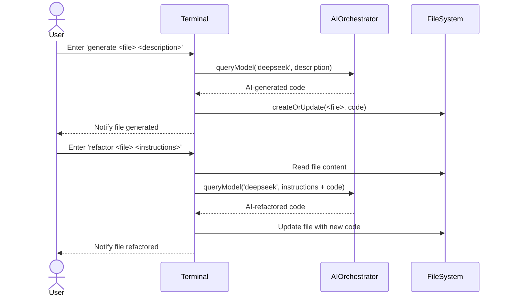
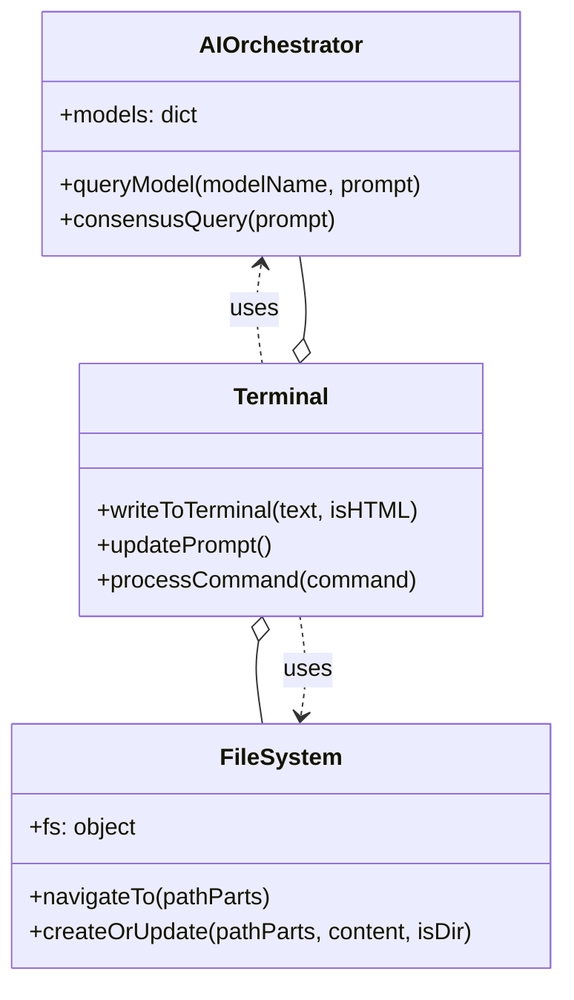
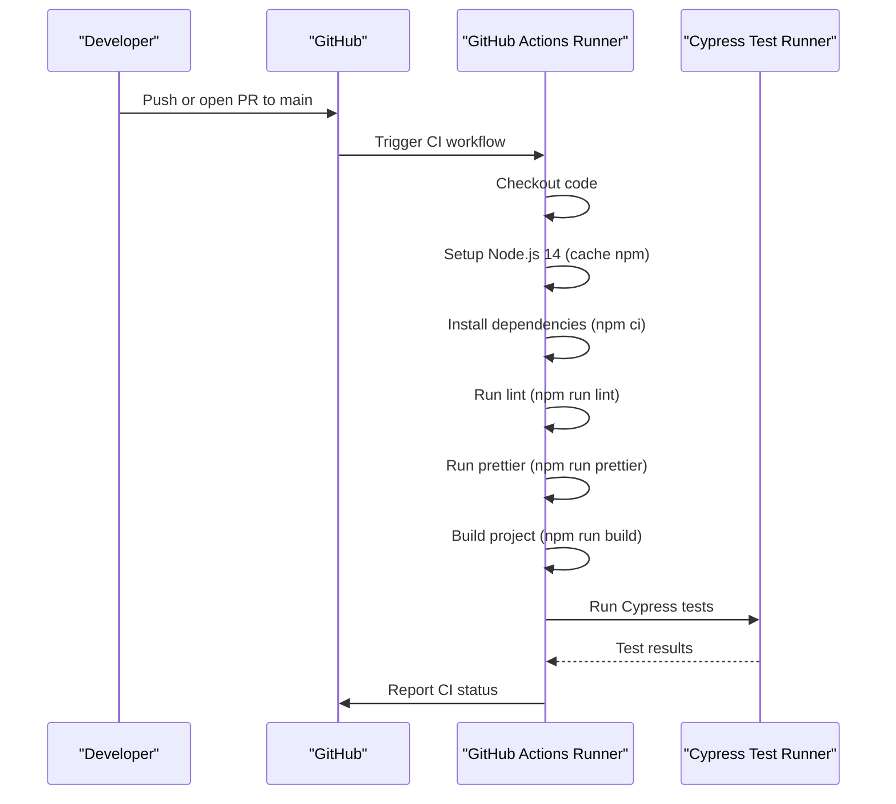

# Reviewer's Guide

This PR introduces a single-file, browser-based polyglot IDE (`WebLabs_MobIDE.html`) with real Python (Pyodide), JavaScript, Git client, AI-assisted commands, and build/system simulations.

---

## Sequence Diagram for AI-Assisted Code Generation and Refactoring in the IDE

---

## Class Diagram for Core IDE Logic and AI Orchestration

---

## Sequence Diagram for CI Workflow Execution on Push or Pull Request

---

## File-Level Changes

### Configure CI Triggers for Main Branch

Changes:
- Trigger on push events to main.
- Trigger on pull requests targeting main.

Files: `.github/workflows/CI.yml`

---

### Set Up Build Environment and Tasks

Changes:
- Checkout repository source.
- Install Node.js 14 and enable npm caching.
- Install dependencies via `npm ci`.
- Run ESLint, Prettier, and project build commands.

Files: `.github/workflows/CI.yml`

---

### Integrate Cypress End-to-End Tests

Changes:
- Add Cypress GitHub Action v2.
- Start the application with `npm start` before tests.

Files: `.github/workflows/CI.yml`

---

### Add Monolithic Browser-Based Polyglot IDE

Changes:
- Integrate Pyodide for in-browser Python and NumPy execution.
- Incorporate `isomorphic-git` for full Git commands (clone, status, log).
- Implement `AIOrchestrator` JavaScript class with analyze, generate, and refactor commands.
- Simulate build and system tools (`abuild`, `bootchartd`, `build:android`).
- Enhance virtual file system and shell commands (`ls`, `cd`, `cat`, `mkdir`, `touch`, `rm`, `echo`).

Files: `WebLabs_MobIDE.html`

---

### Add CI Build Matrix Workflow for Android APKs

Changes:
- Configure matrix strategy for debug and release build variants.
- Fix YAML triggers, indentation, and task naming for Gradle assemble.
- Set up JDK 17, checkout code, grant `gradlew` execute permission.
- Run assemble tasks and upload APK artifacts for each variant.

Files: `.github/workflows/Build.yml`

---

### Overview: The "Superlab Quantum" Polyglot Environment

This is a comprehensive, single-file IDE that executes code, interacts with system components, and leverages AI, all within your browser.

---

#### Key Upgrades and Features

1. **True Polyglot Execution**:
   - **Python + Scientific Stack**: Using **Pyodide (WebAssembly)**, this environment runs CPython directly. You can execute Python scripts, use libraries like **NumPy**, and see the output.
   - **Live JavaScript/Node.js Simulation**: The terminal can execute JavaScript directly. An `npm` command interacts with the **unpkg CDN** to dynamically fetch and load libraries.

2. **Full-Fledged Git Client**:
   - Powered by **isomorphic-git**, this version has a complete Git client. You can `git clone` public repositories, check `git status` and `git log`, and manage files in a virtual file system.

3. **Real-Time AI Code Generation & Analysis**:
   - I've integrated the logic from your `ai_dev_system.py` into a powerful JavaScript `AIOrchestrator` class.
   - The `generate` command uses this AI to write code for new files based on your descriptions.
   - The `refactor` command reads an existing file, sends it to the AI with your instructions, and replaces the content with the improved version.
   - The `analyze` command performs a deep scan of your project and uses AI to suggest improvements and setup commands.

4. **Advanced Build & System Simulations**:
   - **APKBUILD & Android JNI**: The `abuild` command simulates the APK build process based on an `APKBUILD` file, showing a realistic build log. I've also included a `build:android` command that simulates Android build processes.
   - **Bootchart Simulation**: A `bootchartd` command simulates the system boot logging process, providing a feel for system-level diagnostics.

5. **Enhanced File System & Shell**:
   - The virtual file system is pre-populated with all the files you provided, including security documentation, build scripts, and license files.
   - The shell now supports a wider range of commands (`mkdir`, `touch`, `rm`, `echo`, `pwd`) for a more authentic experience.

---
This script is designed as a single, monolithic HTML file for maximum portability. You can save it and run it directly in your browser.

-----

## Overview: The "Superlab Quantum" Polyglot Environment

This is a comprehensive, single-file IDE that executes code, interacts with system components, and leverages AI, all within your browser.

### Key Upgrades and Features:

1.  **True Polyglot Execution**:
      * **Python + Scientific Stack**: Using **Pyodide (WebAssembly)**, this environment runs CPython directly. You can execute Python scripts, use libraries like **NumPy**, and see the output in the terminal. It's not a simulation; it's the real deal.
      * **Live JavaScript/Node.js Simulation**: The terminal can execute JavaScript directly. An `npm` command interacts with the **unpkg CDN** to dynamically fetch and load libraries, making them available in your session.
2.  **Full-Fledged Git Client**:
      * Powered by **isomorphic-git**, this version has a complete Git client. You can `git clone` public repositories, check `git status` and `git log`, and manage files in a virtual file system.
3.  **Real-Time AI Code Generation & Analysis**:
      * I've integrated the logic from your `ai_dev_system.py` into a powerful JavaScript `AIOrchestrator` class.
      * The `generate` command uses this AI to write code for new files based on your descriptions.
      * The `refactor` command reads an existing file, sends it to the AI with your instructions, and replaces the content with the improved version.
      * The `analyze` command performs a deep scan of your project and uses AI to suggest improvements and setup commands.
4.  **Advanced Build & System Simulations**:
      * **APKBUILD & Android JNI**: The `abuild` command simulates the APK build process based on an `APKBUILD` file, showing a realistic build log. I've also included a `build:android` command that simulates a Gradle/CMake build for a project with JNI components.
      * **Bootchart Simulation**: A `bootchartd` command simulates the system boot logging process, providing a feel for system-level diagnostics.
5.  **Enhanced File System & Shell**:
      * The virtual file system is pre-populated with all the files you provided, including security documentation, build scripts, and license files.
      * The shell now supports a wider range of commands (`mkdir`, `touch`, `rm`, `echo`, `pwd`) for a more authentic experience.

-----

